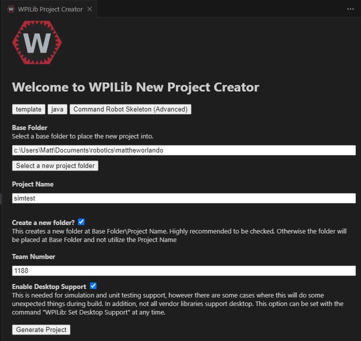
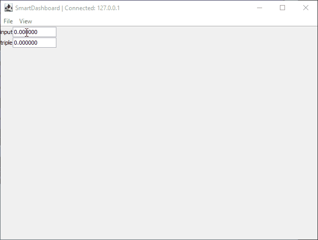
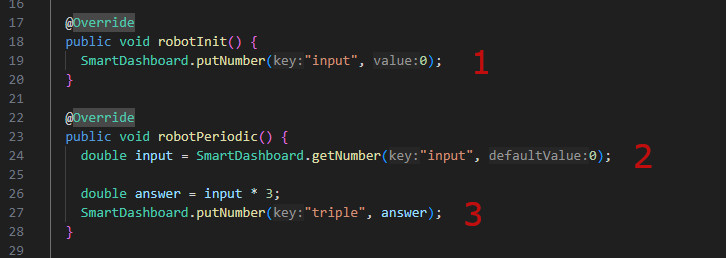

This course aims to get the user running and interacting with robot code quickly and without needing a physical robot.

### Setup
1. Hit the Start key on the keyboard and type "2024 wpi" and see if a result appears for "2024 WPILib VS Code"
1. If yes, skip to the next section, if not, follow the next steps
1. Navigate to https://docs.wpilib.org/en/stable/docs/zero-to-robot/step-2/wpilib-setup.html
1. Download and install using the default or recommended options

### Create your first project
1. Open 2024 WPILib VS Code
1. Hit the "F1" key to bring up the command pallete
1. Type "Create" and choose the "WPILib: Create a new project" option
1. Clck "Select a project type" and choose "Template" -> "java" -> "Command Robot Sekeleton"
1. Click "Select a new project folder" to open the folder chooser dialog
1. Click the "Documents" option on the left to the go the Documents folder of the current user
1. Create folder "robotics" if it does not yet exist
1. In the robotics folder create a new folder using your first and last name and select it
1. Select the folder you created in the previous step
1. Use "simtest" as the Project Name
1. Enable "Create a new folder"
1. Enter your team's number
1. Enable Desktop Support

The project creation wizard should now look like this:  
  

Click Generate Project and choose "Yes (Current Window)

### Running your first simulation
In the Explorer on the left of VS Code open file `src\main\java\frc\robot\Robot.java` and replace the `robotInit` and `robotPeriodic` methods with the following:
```
  @Override
  public void robotInit() {
    SmartDashboard.putNumber("input", 0);
  }

  @Override
  public void robotPeriodic() {
    double input = SmartDashboard.getNumber("input", 0);

    double answer = input * 3;
    SmartDashboard.putNumber("triple", answer);
  }
```

1. At the top right of Visual Studio Code click the "..." button and choose "Simulate Robot Code"
1. A prompt will appear at the top middle of the screen with "Sim GUI" selected, Click OK at the top right of the prompt.
1. Hit the Windows key on your keyboared and search for "SmartDashboard 2024" and run it
1. For the team number enter "localhost". The result should look like this:  
  

1. The SmartDashboard should display two text boxes with labels to their left.
1. Entering a number in the "input" textbox and then press the tab key. Once the tab key is pressed the robot can read the new value from the dashboard and will calculate a value triple that of the input and put it into the "triple" text box.

#### Code Review
  
1. `robotInit` runs at robot startup, and `SmartDashboard.putNumber` is used to place the input number box on the dashboard. Without this step there would not be an input shown on the dashboard, and thus no way for the user to provide input.
2. `robotPeriodic` runs 50 times per second, and `SmartDashboard.getNumber` reads the input value from the dashboard.
3. Here input is multiplied by three with the resulting value assigned to the `answer` variable. The value of `answer` is then sent to the dashboard.

### Next Steps (Rough Draft)
1. Debugging with breakpoints
1. Conditional Breakpoints (`input = 3`), breakpoint will only hit when 3 is entered into the input box on SmartDashboard
1. If statement to only call `SmartDashboard.putNumber` when input changes
1. Calculator Project: Addition, Subtraction, Multiplication, Division all with `SmartDashboard.putNumber` and `SmartDashboard.getNumber`
1. Calculator Project: Turn each operation should be it's own subsystem